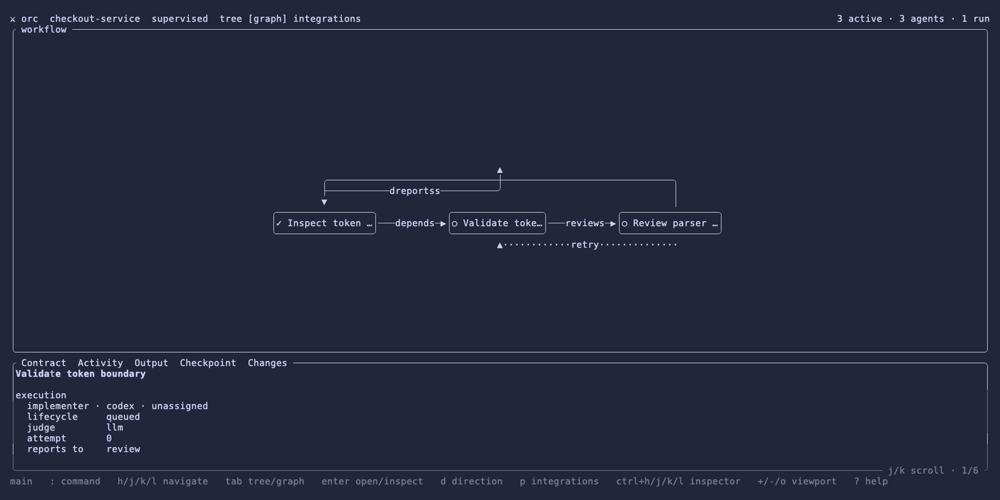

# Orc




Orc is a local control plane for agent harnesses. It records agent sessions and
executes versioned workflow graphs. External providers add harness, execution,
persistence, display, activity, and change integrations.

The core is a standalone Rust CLI. Its full-screen interface uses Ratatui and
Rataflow. Orc does not require a remote broker, terminal multiplexer, or
specific agent harness. A small local supervisor enforces leases for managed
child sessions and exits when no managed work remains.

## Terms

- An orchestrator is the root harness session for one workspace.
- A workflow is a versioned YAML definition stored in Orc's Git catalog.
- A run is one execution of a workflow definition.
- A node is one stage with a role, contract, state, and optional harness
  session.
- A provider is an external command that implements one or more Orc
  capabilities.

Sessions and workflow state are bound to the canonical repository directory.
Resuming a harness in that directory can adopt it as the current orchestrator
without reviving an unrelated workspace.

## Use Orc

Open the dashboard for the current repository:

```bash
orc
```

The dashboard opens on the workspace tree. It shows the orchestrator, its
agents, and their workflow runs in one ownership hierarchy. Press `Tab` to
switch between the tree and the selected run's workflow graph. Press `p` to
inspect integrations, then `Esc` to return to work.

The graph places the orchestrator above its stage ranks. Delegation, dependency,
review, and report arrows show the planned contracts and their live state.
Press `g` on a run to open its graph. Press `Enter` on any run, stage, or agent
to focus its active display or launch a display for a dormant session.

Use `hjkl` inside the focused pane. Use `Ctrl-h/j/k/l` to move between work and
the inspector. `Tab` and `Shift-Tab` cycle the selected run, stage, agent, or
provider's contextual inspector tabs. The mouse wheel zooms the graph within
its safe range. Drag the blank canvas to pan; Orc keeps the graph inside its
viewport. Changes load when the dashboard opens. Press `?` for generated key
help.

Register an orchestrator session:

```bash
orc connect \
  --harness codex \
  --role orchestrator \
  --purpose "Build Orc" \
  --goal "Ship a usable local control plane" \
  --expected-output "Passing checks and a tested TUI" \
  --native-id "$CODEX_THREAD_ID"
```

Register a child session with `--parent <orc-session-id>`.

Managed sessions have two leases. The runtime lease sets a hard deadline.
The idle lease expires when no useful activity is reported. An orchestrator
renews the idle lease only after it verifies that work continues:

```bash
orc session keepalive <child-session-id>
```

Orc starts the supervisor when the first managed child registers. Use
`orc start`, `orc stop`, or `orc daemon status` to manage it directly. On lease
expiry, Orc calls the external `session.stop` provider and records the reason.
Connected orchestrators and unmanaged sessions are never timed out.
Set either lifecycle timeout to `0` to disable that deadline. Agent workflow
steps can override them with `timeoutSeconds` and `idleTimeoutSeconds`.
Only the orchestrator can renew a lease. A keepalive renews the idle deadline;
it never moves the hard runtime deadline or changes the lease policy.
`orc stop` records a cooperative stop request and waits for a clean exit. A
manual sweep refuses to run while the daemon owns the lease loop.

Orc is a reliability control plane, not a security boundary between processes
running as the same operating-system user. Use a sandboxed execution provider
when a harness must not access Orc state or process controls.

```bash
orc status --json
orc list --json
orc provider list --json
orc attach <orc-session-id> --direction right
orc inspect <orc-session-id> --direction right
orc disconnect <orc-session-id>
```


Use `orc session adopt` inside a pre-existing harness session to make it the
new orchestrator for the current directory. Orc archives the previous active
orchestrator incarnation. Use `orc session archive` when an unhooked harness
ends. Harness exit hooks should call `orc session archive --hook-input --quiet`.

## Run a workflow

Create a starter definition in the current workspace's workflow catalog:

```bash
orc workflow init provider-migration
orc workflow edit provider-migration
orc workflow validate "$(orc workflow path provider-migration)"
orc workflow plan provider-migration
orc workflow start provider-migration --background
```

An orchestrator can also propose and start definitions through Orc's MCP tools.
Orc validates the proposal before it commits the YAML definition. Ready nodes
run concurrently. Each agent node chooses a harness, model, execution provider,
and judge policy. A nested workflow node composes another definition.

Workspace autonomy controls when a proposal starts:

- `supervised` creates a proposal and asks before each stage.
- `approval_gated` creates a proposal and asks only at declared gates.
- `autonomous` validates the proposal and starts ready nodes immediately.
  Explicit human-gate stages still wait for a person.

`orc mode` shows the current workspace mode. `orc mode autonomous` changes it.
Press `m` in the dashboard to cycle modes. Proposed workflow nodes stay
editable in every mode. Press `e` on a stage to edit its contract, runtime, and
dependencies. Press `D` to remove it after confirmation. Orc versions these
edits in the workflow Git catalog.

Use `orc run approve <run-id>` to continue a waiting run. Use
`orc guide <session-id> --text '...'` for a provider-supported correction.
Use `orc run cancel <run-id>` to stop a run.

Workflow definitions live under `~/.local/share/orc/workflows` by default.
Each workspace gets a directory inside that Git repository. Use
`orc workflow history`, `orc workflow search`, and `orc workflow path` to
inspect prior definitions.

## Providers

Orc discovers YAML or JSON manifests recursively from
`~/.config/orc/providers/`. The standard layout is
`~/.config/orc/providers/<name>/provider.yaml`. Set
`ORC_PROVIDERS_DIRECTORY` to use another directory.

Each provider advertises one kind and a set of capabilities:

```yaml
# yaml-language-server: $schema=https://raw.githubusercontent.com/roshbhatia/orc/main/schema/provider.schema.json
version: orc.provider/v1
name: wezterm
description: Open provider command plans in a WezTerm pane
kind: display
command: /path/to/orc-provider-wezterm
actions:
  session.bind: Detect the current WezTerm pane
  terminal.open: Open a command in a split pane
  terminal.focus: Focus an existing pane
priority: 100
```

The manifest is the language-neutral shim. Its `actions` map advertises what
the provider does. The command can use Bash, TypeScript, Go, Rust, or any other
language that can read JSON from stdin and write JSON to stdout. Orc validates
the manifest, executable, dependencies, and protocol with:

```bash
orc provider validate
orc provider validate wezterm
```

Provider kinds describe session facets:

- `harness` resumes the native harness session.
- `persistence` keeps a process available after its display closes.
- `display` opens the selected command for the user.
- `activity` supplies messages, reasoning summaries, and tool activity.
- `changes` supplies repository changes.

Several providers can bind to one session. Orc reconciles every recorded
session when the dashboard opens. It also reconciles new hook registrations.

An active Zmx binding requires the harness process to start inside Zmx. Zmx
cannot wrap a process that already runs. An existing session can still gain a
Zmx binding when its next harness resume starts through Zmx.

Actions resolve through capability chains. Optional steps are marked with `?`:

```text
attach    session.attach -> session.persist? -> terminal.open
inspect   session.inspect -> terminal.open
activity  activity.read | execution.logs | session.inspect
changes   changes.inspect
launch    session.launch -> session.persist? -> execution.run
execute   execution.run
stop      session.stop | execution.cancel
```

Orc writes one `orc.provider/v1` request to each provider command. A provider
can return a command plan, a session binding, a description, or an explicit
decline. An explicit decline lets the next provider handle that capability.
Command plans may declare `successCodes`; the default is `[0]`. This lets a
provider preserve command-specific results such as Traces exit status 2.
Lifecycle requests include an immutable `operationId`. A `session.stop` or
`execution.cancel` provider must make retries with the same operation ID
idempotent. Providers must bind the action to the strongest stable identity
their backend exposes and document weaker guarantees. Zmx exposes only a
name-based kill. Its adapter verifies the recorded process ID and creation time
immediately before that kill, but it cannot make name reuse atomic. Use a
sandboxed execution provider when that same-user race is outside your trust
boundary.

Local command plans must stay in their assigned process group. A command that
detaches with `setsid` leaves local supervision. Use an execution provider when
work needs an independent daemon or a stronger containment boundary.

The final command plan inherits terminal state. Captured output preserves ANSI
color in the TUI. Reconciliation caches content-addressed description
responses for the configured TTL. Dynamic bindings are always read again.
Orc itself does not import Zmx,
WezTerm, Traces, or Changes.

The optional provider packages live in [`extras/`](extras/README.md). Install
only the adapters your environment uses:

```bash
nix profile install github:roshbhatia/orc#provider-harness
nix profile install github:roshbhatia/orc#provider-zmx
nix profile install github:roshbhatia/orc#provider-wezterm
```

Every provider directory owns its adapter, manifest, and Nix runtime
dependencies. `#extras` installs all providers. `#full` installs provider-neutral
core plus that bundle. The default package remains core only.

Orc reads provider manifests in precedence order. It checks the configured
provider directory first, then `$XDG_DATA_HOME/orc/providers`, then each
`orc/providers` directory under `$XDG_DATA_DIRS`. A higher-precedence provider
shadows an installed provider with the same name. Nix profile installs are
therefore discoverable without copying their manifests into user config.

Without providers, Orc still records sessions, workflows, nodes, and contracts.
The local supervisor has no harness or terminal integration of its own.

## Configure Orc

Orc reads `~/.config/orc/config.yaml`. Set `ORC_CONFIG` to use another file.
The configuration stays directory-independent. Session state remains bound to
the canonical workspace directory.

```yaml
# yaml-language-server: $schema=https://raw.githubusercontent.com/roshbhatia/orc/main/schema/orc.schema.json
cache:
  providerTtlMs: 30000
daemon:
  autostart: true
  scanIntervalMs: 5000
  idleShutdownSeconds: 60
  terminationRetrySeconds: 60
lifecycle:
  runtimeTimeoutSeconds: 28800
  idleTimeoutSeconds: 1800
providers:
  directory: ~/.config/orc/providers
  timeoutMs: 15000
workflows:
  repository: ~/.local/share/orc/workflows
  autoCommit: true
  maxDepth: 10
ui:
  refreshMs: 5000
  activityRefreshMs: 10000
  inspectorPercent: 38
```

Set `daemon.terminationRetrySeconds` to `0` to retry a failed termination on
the next daemon sweep. Positive values impose that many seconds between
attempts.

Every scalar supports a nested environment override:

```bash
ORC_CACHE_PROVIDER_TTL_MS=0 orc status
ORC_DAEMON_AUTOSTART=false orc status
ORC_LIFECYCLE_IDLE_TIMEOUT_SECONDS=3600 orc start
ORC_PROVIDERS_DIRECTORY=/tmp/orc-providers orc providers
ORC_PROVIDERS_TIMEOUT_MS=10000 orc
ORC_WORKFLOWS_REPOSITORY=/tmp/orc-workflows orc workflow list
ORC_UI_REFRESH_MS=1000 orc
```

`ORC_PROVIDER_DIR` and `ORC_PROVIDER_TIMEOUT_MS` remain compatibility aliases.
The generated schema supports YAML editor validation.

<!-- BEGIN GENERATED:commands -->
### `orc tui`

Open the control plane

```text
Open the control plane

Usage: orc tui [OPTIONS]

Options:
      --scope <SCOPE>  [env: ORC_SCOPE=] [default: .]
  -h, --help           Print help
```

### `orc status`

Show workspace status

```text
Show workspace status

Usage: orc status [OPTIONS]

Options:
      --scope <SCOPE>  [env: ORC_SCOPE=] [default: .]
      --json
  -h, --help           Print help
```

### `orc start`

Start the managed-session supervisor

```text
Start the managed-session supervisor

Usage: orc start

Options:
  -h, --help  Print help
```

### `orc stop`

Stop the managed-session supervisor

```text
Stop the managed-session supervisor

Usage: orc stop

Options:
  -h, --help  Print help
```

### `orc daemon`

Manage the managed-session supervisor

```text
Manage the managed-session supervisor

Usage: orc daemon <COMMAND>

Commands:
  start
  stop
  status
  sweep
  help    Print this message or the help of the given subcommand(s)

Options:
  -h, --help  Print help
```

### `orc daemon start`

```text
Usage: orc daemon start

Options:
  -h, --help  Print help
```

### `orc daemon stop`

```text
Usage: orc daemon stop

Options:
  -h, --help  Print help
```

### `orc daemon status`

```text
Usage: orc daemon status [OPTIONS]

Options:
      --json
  -h, --help  Print help
```

### `orc daemon sweep`

```text
Usage: orc daemon sweep [OPTIONS]

Options:
      --json
  -h, --help  Print help
```

### `orc mode`

Show or change this workspace's autonomy mode

```text
Show or change this workspace's autonomy mode

Usage: orc mode [OPTIONS] [MODE]

Arguments:
  [MODE]

Options:
      --scope <SCOPE>  [env: ORC_SCOPE=] [default: .]
  -h, --help           Print help
```

### `orc list`

List registered sessions

```text
List registered sessions

Usage: orc list [OPTIONS]

Options:
      --scope <SCOPE>  [env: ORC_SCOPE=] [default: .]
      --json
  -h, --help           Print help
```

### `orc connect`

Register the current session

```text
Register the current session

Usage: orc connect [OPTIONS]

Options:
      --scope <SCOPE>                              [env: ORC_SCOPE=] [default: .]
      --harness <HARNESS>                          [default: unknown]
      --model <MODEL>
      --role <ROLE>                                [default: worker]
      --title <TITLE>                              [default: "Agent session"]
      --purpose <PURPOSE>                          [default: "Agent session"]
      --goal <GOAL>                                [default: "Complete the assigned work"]
      --expected-output <EXPECTED_OUTPUT>          [default: "A verified result"]
      --success <SUCCESS_CRITERIA>
      --completion <COMPLETION>                    [default: orchestrator]
      --review-by <REVIEW_BY>
      --id <ID>
      --native-id <NATIVE_ID>
      --parent <PARENT_ID>
      --run <RUN_ID>
      --node <NODE_ID>
      --provider-ref <PROVIDER_REF>
      --source <SOURCE>                            [default: connected]
      --runtime-timeout <RUNTIME_TIMEOUT_SECONDS>
      --idle-timeout <IDLE_TIMEOUT_SECONDS>
      --hook-input
      --quiet
  -h, --help                                       Print help
```

### `orc session`

Manage sessions

```text
Manage sessions

Usage: orc session <COMMAND>

Commands:
  register
  adopt
  archive
  prune      Stop an active agent through its provider, then archive it
  current
  list
  update
  keepalive  Renew a managed session's idle lease
  help       Print this message or the help of the given subcommand(s)

Options:
  -h, --help  Print help
```

### `orc session register`

```text
Usage: orc session register [OPTIONS]

Options:
      --scope <SCOPE>                              [env: ORC_SCOPE=] [default: .]
      --harness <HARNESS>                          [default: unknown]
      --model <MODEL>
      --role <ROLE>                                [default: worker]
      --title <TITLE>                              [default: "Agent session"]
      --purpose <PURPOSE>                          [default: "Agent session"]
      --goal <GOAL>                                [default: "Complete the assigned work"]
      --expected-output <EXPECTED_OUTPUT>          [default: "A verified result"]
      --success <SUCCESS_CRITERIA>
      --completion <COMPLETION>                    [default: orchestrator]
      --review-by <REVIEW_BY>
      --id <ID>
      --native-id <NATIVE_ID>
      --parent <PARENT_ID>
      --run <RUN_ID>
      --node <NODE_ID>
      --provider-ref <PROVIDER_REF>
      --source <SOURCE>                            [default: connected]
      --runtime-timeout <RUNTIME_TIMEOUT_SECONDS>
      --idle-timeout <IDLE_TIMEOUT_SECONDS>
      --hook-input
      --quiet
  -h, --help                                       Print help
```

### `orc session adopt`

```text
Usage: orc session adopt [OPTIONS]

Options:
      --scope <SCOPE>                      [env: ORC_SCOPE=] [default: .]
      --harness <HARNESS>                  [default: unknown]
      --model <MODEL>
      --role <ROLE>                        [default: worker]
      --title <TITLE>                      [default: "Agent session"]
      --purpose <PURPOSE>                  [default: "Agent session"]
      --goal <GOAL>                        [default: "Complete the assigned work"]
      --expected-output <EXPECTED_OUTPUT>  [default: "A verified result"]
      --success <SUCCESS_CRITERIA>
      --completion <COMPLETION>            [default: orchestrator]
      --review-by <REVIEW_BY>
      --native-id <NATIVE_ID>
  -h, --help                               Print help
```

### `orc session archive`

```text
Usage: orc session archive [OPTIONS] [ID]

Arguments:
  [ID]

Options:
      --scope <SCOPE>          [env: ORC_SCOPE=] [default: .]
      --native-id <NATIVE_ID>
      --hook-input
      --quiet
  -h, --help                   Print help
```

### `orc session prune`

Stop an active agent through its provider, then archive it

```text
Stop an active agent through its provider, then archive it

Usage: orc session prune [OPTIONS] <ID>

Arguments:
  <ID>

Options:
      --scope <SCOPE>  [env: ORC_SCOPE=] [default: .]
  -h, --help           Print help
```

### `orc session current`

```text
Usage: orc session current [OPTIONS]

Options:
      --scope <SCOPE>  [env: ORC_SCOPE=] [default: .]
      --json
  -h, --help           Print help
```

### `orc session list`

```text
Usage: orc session list [OPTIONS]

Options:
      --scope <SCOPE>  [env: ORC_SCOPE=] [default: .]
      --json
  -h, --help           Print help
```

### `orc session update`

```text
Usage: orc session update [OPTIONS] --status <STATUS> <ID>

Arguments:
  <ID>

Options:
      --scope <SCOPE>    [env: ORC_SCOPE=] [default: .]
      --status <STATUS>
  -h, --help             Print help
```

### `orc session keepalive`

Renew a managed session's idle lease

```text
Renew a managed session's idle lease

Usage: orc session keepalive [OPTIONS] [ID]

Arguments:
  [ID]

Options:
      --scope <SCOPE>  [env: ORC_SCOPE=] [default: .]
  -h, --help           Print help
```

### `orc run`

Manage workflow runs

```text
Manage workflow runs

Usage: orc run <COMMAND>

Commands:
  create
  agent
  list
  show
  update
  resume
  approve
  cancel
  help     Print this message or the help of the given subcommand(s)

Options:
  -h, --help  Print help
```

### `orc run create`

```text
Usage: orc run create [OPTIONS] --name <NAME> --goal <GOAL> --expected-output <EXPECTED_OUTPUT>

Options:
      --scope <SCOPE>                      [env: ORC_SCOPE=] [default: .]
      --name <NAME>
      --goal <GOAL>
      --expected-output <EXPECTED_OUTPUT>
      --orchestrator <ORCHESTRATOR_ID>
      --harness <HARNESS>
      --model <MODEL>
      --json
  -h, --help                               Print help
```

### `orc run agent`

```text
Usage: orc run agent [OPTIONS] --role <ROLE> --harness <HARNESS> <ID>

Arguments:
  <ID>

Options:
      --scope <SCOPE>      [env: ORC_SCOPE=] [default: .]
      --role <ROLE>
      --harness <HARNESS>
      --model <MODEL>
  -h, --help               Print help
```

### `orc run list`

```text
Usage: orc run list [OPTIONS]

Options:
      --scope <SCOPE>  [env: ORC_SCOPE=] [default: .]
      --json
  -h, --help           Print help
```

### `orc run show`

```text
Usage: orc run show [OPTIONS] <ID>

Arguments:
  <ID>

Options:
      --scope <SCOPE>  [env: ORC_SCOPE=] [default: .]
      --json
  -h, --help           Print help
```

### `orc run update`

```text
Usage: orc run update [OPTIONS] --status <STATUS> <ID>

Arguments:
  <ID>

Options:
      --scope <SCOPE>    [env: ORC_SCOPE=] [default: .]
      --status <STATUS>
  -h, --help             Print help
```

### `orc run resume`

```text
Usage: orc run resume [OPTIONS] <ID>

Arguments:
  <ID>

Options:
      --scope <SCOPE>  [env: ORC_SCOPE=] [default: .]
  -h, --help           Print help
```

### `orc run approve`

```text
Usage: orc run approve [OPTIONS] <ID>

Arguments:
  <ID>

Options:
      --scope <SCOPE>  [env: ORC_SCOPE=] [default: .]
      --gate <GATE>
      --no-resume
  -h, --help           Print help
```

### `orc run cancel`

```text
Usage: orc run cancel [OPTIONS] <ID>

Arguments:
  <ID>

Options:
      --scope <SCOPE>  [env: ORC_SCOPE=] [default: .]
  -h, --help           Print help
```

### `orc node`

Manage workflow nodes

```text
Manage workflow nodes

Usage: orc node <COMMAND>

Commands:
  upsert
  update
  edit
  delete
  dependency
  help        Print this message or the help of the given subcommand(s)

Options:
  -h, --help  Print help
```

### `orc node upsert`

```text
Usage: orc node upsert [OPTIONS] --run <RUN_ID> <ID>

Arguments:
  <ID>

Options:
      --scope <SCOPE>                      [env: ORC_SCOPE=] [default: .]
      --run <RUN_ID>
      --harness <HARNESS>                  [default: unknown]
      --model <MODEL>
      --role <ROLE>                        [default: worker]
      --title <TITLE>                      [default: "Agent session"]
      --purpose <PURPOSE>                  [default: "Agent session"]
      --goal <GOAL>                        [default: "Complete the assigned work"]
      --expected-output <EXPECTED_OUTPUT>  [default: "A verified result"]
      --success <SUCCESS_CRITERIA>
      --completion <COMPLETION>            [default: orchestrator]
      --review-by <REVIEW_BY>
      --session <SESSION_ID>
      --status <STATUS>                    [default: queued]
      --attempt <ATTEMPT>                  [default: 0]
      --depends-on <DEPENDS_ON>
      --execution <EXECUTION>
      --judge-policy <JUDGE_POLICY>        [default: llm]
  -h, --help                               Print help
```

### `orc node update`

```text
Usage: orc node update [OPTIONS] --run <RUN_ID> --status <STATUS> <ID>

Arguments:
  <ID>

Options:
      --scope <SCOPE>    [env: ORC_SCOPE=] [default: .]
      --run <RUN_ID>
      --status <STATUS>
  -h, --help             Print help
```

### `orc node edit`

```text
Usage: orc node edit [OPTIONS] --run <RUN_ID> <ID>

Arguments:
  <ID>

Options:
      --scope <SCOPE>                      [env: ORC_SCOPE=] [default: .]
      --run <RUN_ID>
      --goal <GOAL>
      --expected-output <EXPECTED_OUTPUT>
      --success <SUCCESS_CRITERIA>
      --harness <HARNESS>
      --model <MODEL>
      --execution <EXECUTION>
      --judge-policy <JUDGE_POLICY>
  -h, --help                               Print help
```

### `orc node delete`

```text
Usage: orc node delete [OPTIONS] --run <RUN_ID> <ID>

Arguments:
  <ID>

Options:
      --scope <SCOPE>  [env: ORC_SCOPE=] [default: .]
      --run <RUN_ID>
  -h, --help           Print help
```

### `orc node dependency`

```text
Usage: orc node dependency [OPTIONS] --run <RUN_ID> --on <ON> <ID>

Arguments:
  <ID>

Options:
      --scope <SCOPE>  [env: ORC_SCOPE=] [default: .]
      --run <RUN_ID>
      --on <ON>
      --remove
  -h, --help           Print help
```

### `orc provider`

Manage provider manifests

```text
Manage provider manifests

Usage: orc provider <COMMAND>

Commands:
  list
  validate
  help      Print this message or the help of the given subcommand(s)

Options:
  -h, --help  Print help
```

### `orc provider list`

```text
Usage: orc provider list [OPTIONS]

Options:
      --scope <SCOPE>  [env: ORC_SCOPE=] [default: .]
      --json
  -h, --help           Print help
```

### `orc provider validate`

```text
Usage: orc provider validate [OPTIONS] [NAME]

Arguments:
  [NAME]

Options:
      --scope <SCOPE>  [env: ORC_SCOPE=] [default: .]
      --json
  -h, --help           Print help
```

### `orc workflow`

Manage versioned workflow definitions

```text
Manage versioned workflow definitions

Usage: orc workflow <COMMAND>

Commands:
  init
  import
  list
  show
  edit
  validate
  plan
  start
  history
  search
  path
  help      Print this message or the help of the given subcommand(s)

Options:
  -h, --help  Print help
```

### `orc workflow init`

```text
Usage: orc workflow init [OPTIONS] <NAME>

Arguments:
  <NAME>

Options:
      --harness <HARNESS>
      --scope <SCOPE>      [env: ORC_SCOPE=] [default: .]
  -h, --help               Print help
```

### `orc workflow import`

```text
Usage: orc workflow import [OPTIONS] <PATH>

Arguments:
  <PATH>

Options:
      --scope <SCOPE>  [env: ORC_SCOPE=] [default: .]
  -h, --help           Print help
```

### `orc workflow list`

```text
Usage: orc workflow list [OPTIONS]

Options:
      --scope <SCOPE>  [env: ORC_SCOPE=] [default: .]
  -h, --help           Print help
```

### `orc workflow show`

```text
Usage: orc workflow show [OPTIONS] <NAME>

Arguments:
  <NAME>

Options:
      --scope <SCOPE>  [env: ORC_SCOPE=] [default: .]
  -h, --help           Print help
```

### `orc workflow edit`

```text
Usage: orc workflow edit [OPTIONS] <NAME>

Arguments:
  <NAME>

Options:
      --scope <SCOPE>  [env: ORC_SCOPE=] [default: .]
  -h, --help           Print help
```

### `orc workflow validate`

```text
Usage: orc workflow validate <WORKFLOW>

Arguments:
  <WORKFLOW>

Options:
  -h, --help  Print help
```

### `orc workflow plan`

```text
Usage: orc workflow plan [OPTIONS] <WORKFLOW>

Arguments:
  <WORKFLOW>

Options:
      --scope <SCOPE>  [env: ORC_SCOPE=] [default: .]
      --json
  -h, --help           Print help
```

### `orc workflow start`

```text
Usage: orc workflow start [OPTIONS] <WORKFLOW>

Arguments:
  <WORKFLOW>

Options:
      --scope <SCOPE>  [env: ORC_SCOPE=] [default: .]
      --background
      --json
  -h, --help           Print help
```

### `orc workflow history`

```text
Usage: orc workflow history [OPTIONS] <NAME>

Arguments:
  <NAME>

Options:
      --scope <SCOPE>  [env: ORC_SCOPE=] [default: .]
  -h, --help           Print help
```

### `orc workflow search`

```text
Usage: orc workflow search <QUERY>

Arguments:
  <QUERY>

Options:
  -h, --help  Print help
```

### `orc workflow path`

```text
Usage: orc workflow path [OPTIONS] <NAME>

Arguments:
  <NAME>

Options:
      --scope <SCOPE>  [env: ORC_SCOPE=] [default: .]
  -h, --help           Print help
```

### `orc launch`

Launch a managed harness

```text
Launch a managed harness

Usage: orc launch [OPTIONS] <HARNESS> [-- <ARGS>...]

Arguments:
  <HARNESS>
  [ARGS]...

Options:
      --scope <SCOPE>                              [env: ORC_SCOPE=] [default: .]
      --model <MODEL>
      --managed <MANAGED>
      --runtime-timeout <RUNTIME_TIMEOUT_SECONDS>
      --idle-timeout <IDLE_TIMEOUT_SECONDS>
  -h, --help                                       Print help
```

### `orc attach`

Attach through a provider chain

```text
Attach through a provider chain

Usage: orc attach [OPTIONS] <ID>

Arguments:
  <ID>

Options:
      --scope <SCOPE>          [env: ORC_SCOPE=] [default: .]
      --direction <DIRECTION>  [default: right] [possible values: right, left, top, bottom]
  -h, --help                   Print help
```

### `orc inspect`

Inspect through a provider chain

```text
Inspect through a provider chain

Usage: orc inspect [OPTIONS] <ID>

Arguments:
  <ID>

Options:
      --scope <SCOPE>          [env: ORC_SCOPE=] [default: .]
      --direction <DIRECTION>  [default: right] [possible values: right, left, top, bottom]
  -h, --help                   Print help
```

### `orc disconnect`

Disconnect a registered session

```text
Disconnect a registered session

Usage: orc disconnect [OPTIONS] [ID]

Arguments:
  [ID]

Options:
      --scope <SCOPE>  [env: ORC_SCOPE=] [default: .]
  -h, --help           Print help
```

### `orc guide`

Send mid-run guidance

```text
Send mid-run guidance

Usage: orc guide [OPTIONS] --text <TEXT> <ID>

Arguments:
  <ID>

Options:
      --scope <SCOPE>  [env: ORC_SCOPE=] [default: .]
      --text <TEXT>
  -h, --help           Print help
```

### `orc mcp`

Run the MCP server

```text
Run the MCP server

Usage: orc mcp

Options:
  -h, --help  Print help
```

### `orc prompt`

Print the prompt session marker

```text
Print the prompt session marker

Usage: orc prompt [OPTIONS]

Options:
      --scope <SCOPE>  [env: ORC_SCOPE=] [default: .]
  -h, --help           Print help
```

### `orc completion`

Generate shell completions

```text
Generate shell completions

Usage: orc completion <SHELL>

Arguments:
  <SHELL>  [possible values: bash, fish, nu, powershell, zsh]

Options:
  -h, --help  Print help (see more with '--help')
```

### `orc schema`

Print generated JSON schemas

```text
Print generated JSON schemas

Usage: orc schema <SCHEMA>

Arguments:
  <SCHEMA>  [possible values: config, provider, workflow, state]

Options:
  -h, --help  Print help
```
<!-- END GENERATED:commands -->

## Develop Orc

```bash
nix develop --accept-flake-config
cargo test --all-targets
cargo clippy --all-targets -- -D warnings
./hack/generate.sh --check
nix build --accept-flake-config
nix flake check --accept-flake-config
./hack/screenshots.sh
```
